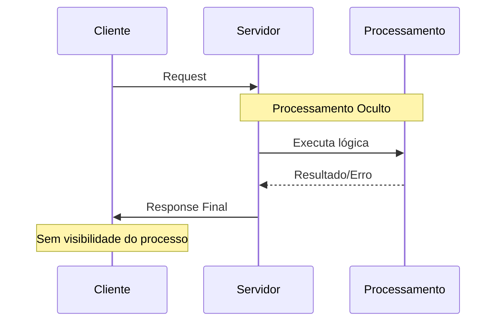
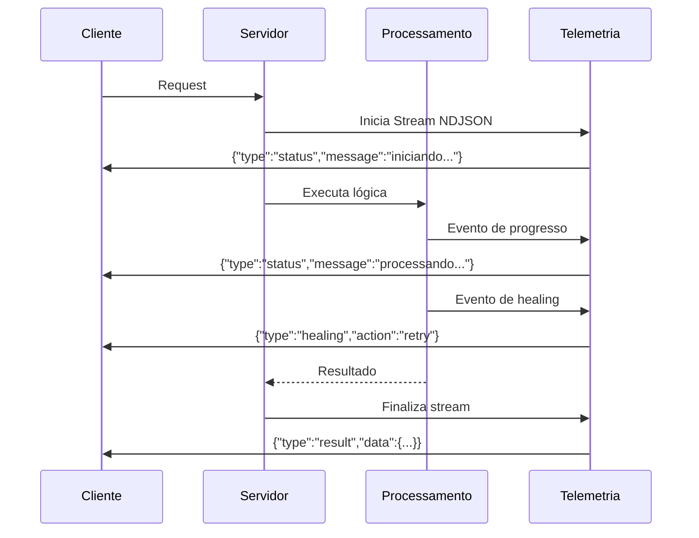
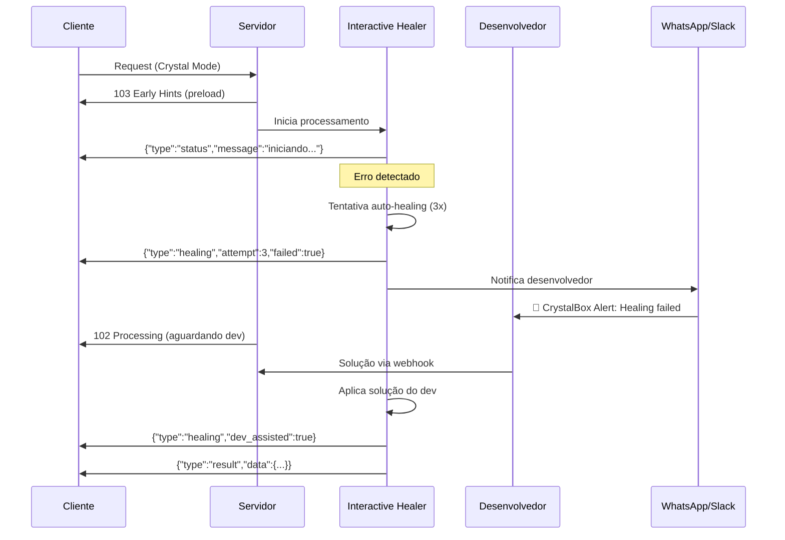
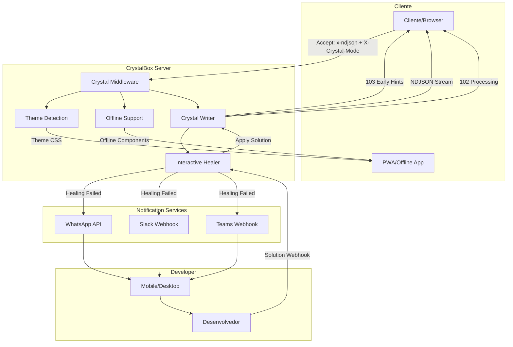
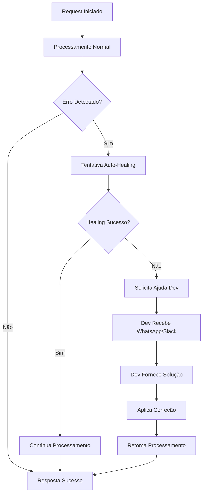
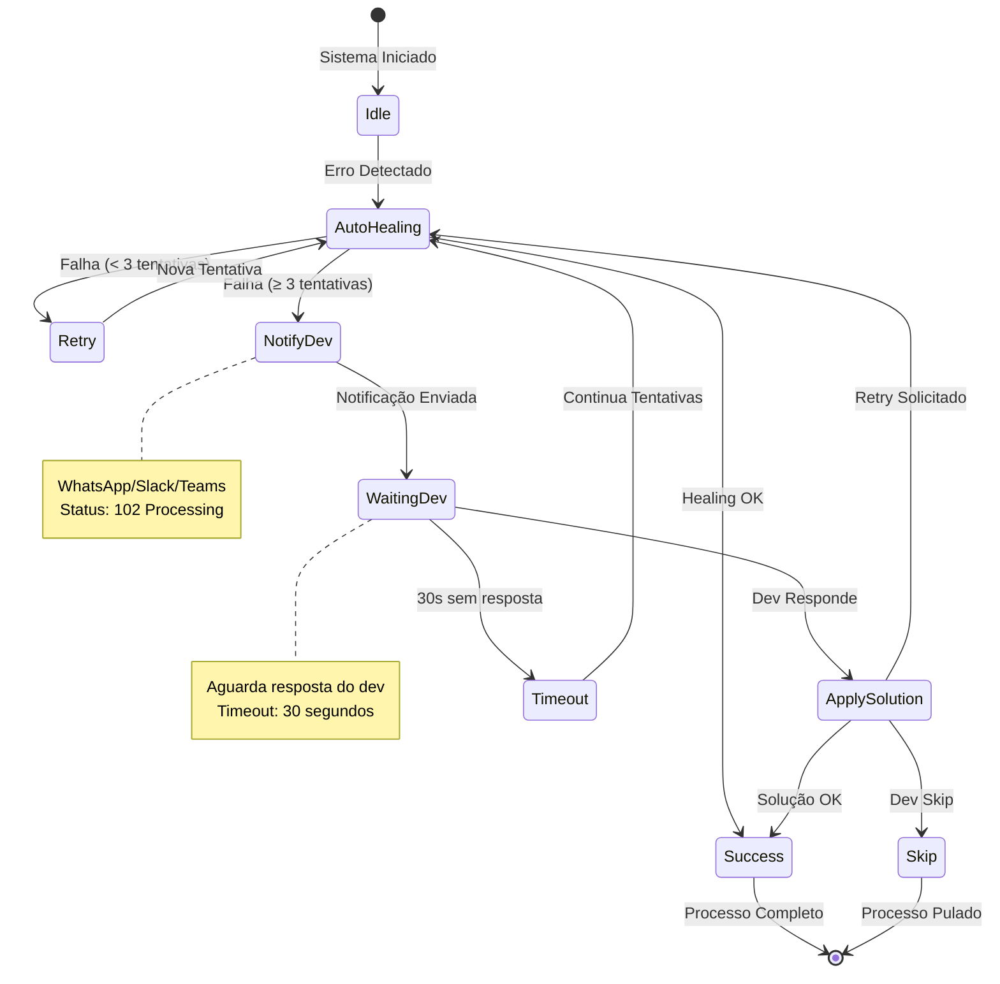
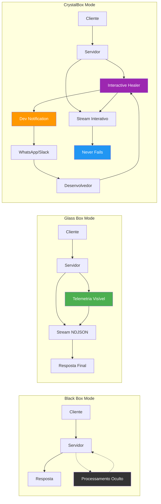

# Observability Modes - PureCore Apify

## 📋 Visão Geral

O PureCore Apify implementa múltiplos modos de observabilidade, evoluindo do conceito tradicional de **Black Box** e **Glass Box** para o inovador **CrystalBox**, que oferece observabilidade em tempo real com interatividade e self-healing automático.

## 🔍 Modos de Observabilidade

### 1. Black Box Mode (Tradicional)
**Header**: `Accept: application/json`



**Características:**
- ✅ Processamento silencioso
- ✅ Resposta única ao final
- ✅ Compatibilidade total com clientes legados
- ❌ Sem visibilidade do processo interno
- ❌ Sem healing visível

### 2. Glass Box Mode (Transparente)
**Header**: `Accept: application/x-ndjson`



**Características:**
- ✅ Streaming de telemetria em tempo real
- ✅ Visibilidade completa do processo
- ✅ Eventos estruturados (status, healing, intent_analysis)
- ❌ Apenas observação passiva
- ❌ Sem interação durante o processo

### 3. ❄️👁️ CrystalBox Mode (Inovação PureCore)
**Header**: `Accept: application/x-ndjson` + `X-Crystal-Mode: interactive`



**Características Únicas:**
- ✅ **Observabilidade em tempo real** (como Glass Box)
- ✅ **Self-healing automático** com tentativas inteligentes
- ✅ **Interatividade com desenvolvedor** quando healing falha
- ✅ **Nunca retorna erro** - sempre tenta se curar
- ✅ **Comunicação bidirecional** durante o processamento
- ✅ **Status codes inteligentes** (102 Processing, 103 Early Hints)


## ❄️👁️ CrystalBox: O Futuro da Observabilidade

### Conceito Inédito

O **CrystalBox** é o primeiro modo de observabilidade que combina:

1. **Transparência Total** (Glass Box)
2. **Interatividade em Tempo Real**
3. **Self-Healing Automático**
4. **Colaboração Humano-IA**

### Arquitetura do CrystalBox



### Fluxo de Healing Interativo



### Estados do Interactive Healer



### Status Codes Inteligentes

#### 🔄 102 Processing (Healing em Andamento)
```http
HTTP/1.1 102 Processing
Content-Type: application/x-ndjson
X-Crystal-Mode: healing
X-Healing-Attempt: 3
X-Dev-Notification: sent

{"type":"healing","action":"database_recovery","attempt":3,"dev_notified":true}
```

#### 🚀 103 Early Hints (Preload Agentic UX)
```http
HTTP/1.1 103 Early Hints
Link: </css/user-theme-dark.css>; rel=preload; as=style
Link: </js/offline-components.js>; rel=preload; as=script
X-User-Theme: dark
X-Offline-Ready: true

{"type":"preload","theme":"dark","offline_components":["forms","cache","sync"]}
```

## 🎯 Agentic UX Integration

### Preload Inteligente

O CrystalBox detecta o tema do usuário em paralelo e envia **103 Early Hints** para precarregar recursos específicos:

```typescript
// Detecção automática de tema
const userTheme = await detectUserTheme(req.user.id);

// Early Hints para preload
res.writeEarlyHints({
  link: [
    `</css/user-theme-${userTheme}.css>; rel=preload; as=style`,
    `</js/offline-components.js>; rel=preload; as=script`,
    `</data/user-preferences.json>; rel=preload; as=fetch`
  ]
});
```

### Offline-First Architecture

```typescript
// Hook de Offline-First
export function useOfflineFirst<T>(key: string, syncFn: () => Promise<T>) {
  const [data, setData] = useState<T | null>(null);
  const [isOnline, setIsOnline] = useState(navigator.onLine);
  
  // Sempre salva localmente ANTES de enviar
  const saveAction = useCallback(async (action: any) => {
    const timestamp = Date.now();
    const localAction = { ...action, timestamp, synced: false };
    
    // 1. Salva local PRIMEIRO
    await localDB.save(key, localAction);
    
    // 2. Tenta sincronizar se online
    if (isOnline) {
      try {
        await syncFn();
        await localDB.markSynced(key, timestamp);
      } catch (error) {
        // Fica na fila para sync posterior
        console.log('Ação salva offline, será sincronizada depois');
      }
    }
  }, [key, syncFn, isOnline]);
  
  return { data, saveAction, isOnline };
}
```

## 🔧 Implementação Técnica

### CrystalBox Middleware

```typescript
export function crystalBoxMiddleware(options: CrystalBoxOptions = {}) {
  return async (req: Request, res: Response, next: NextFunction) => {
    const isCrystalMode = req.headers['x-crystal-mode'] === 'interactive';
    
    if (isCrystalMode) {
      // Configura modo interativo
      const crystalWriter = new CrystalBoxWriter(res, {
        devNotification: options.devNotification,
        maxHealingAttempts: options.maxHealingAttempts || 5,
        healingTimeout: options.healingTimeout || 30000
      });
      
      req.crystalWriter = crystalWriter;
      req.interactiveHealer = new InteractiveHealer(crystalWriter);
    }
    
    next();
  };
}
```

### Interactive Healer

```typescript
class InteractiveHealer extends AONHealer {
  private devNotificationSent = false;
  private healingAttempts = 0;
  
  async heal(action: string, description: string, metadata?: any): Promise<boolean> {
    this.healingAttempts++;
    
    // Tenta healing automático primeiro
    const autoHealed = await super.heal(action, description, metadata);
    
    if (autoHealed) {
      return true;
    }
    
    // Se falhou e ainda não notificou dev
    if (!this.devNotificationSent && this.healingAttempts >= 3) {
      await this.requestDeveloperHelp(action, description, metadata);
      this.devNotificationSent = true;
      
      // Envia 102 Processing enquanto aguarda
      this.writer.writeProcessingStatus({
        message: 'Aguardando intervenção do desenvolvedor...',
        devNotified: true,
        healingAttempt: this.healingAttempts
      });
      
      // Aguarda resposta do dev (com timeout)
      const devSolution = await this.waitForDeveloperResponse(30000);
      
      if (devSolution) {
        return await this.applyDeveloperSolution(devSolution);
      }
    }
    
    return false;
  }
  
  private async requestDeveloperHelp(action: string, description: string, metadata: any) {
    const message = `🚨 CrystalBox Healing Failed
    
Action: ${action}
Description: ${description}
Attempts: ${this.healingAttempts}
Metadata: ${JSON.stringify(metadata, null, 2)}

Request ID: ${this.writer.getRequestId()}
Time: ${new Date().toISOString()}

Reply with solution or 'retry' to attempt again.`;

    // Envia via WhatsApp/Slack/Teams
    await this.notificationService.send({
      type: 'whatsapp',
      to: process.env.DEV_WHATSAPP,
      message,
      requestId: this.writer.getRequestId()
    });
  }
}
```

### Developer Notification Service

```typescript
class DeveloperNotificationService {
  async send(notification: DevNotification): Promise<void> {
    switch (notification.type) {
      case 'whatsapp':
        await this.sendWhatsApp(notification);
        break;
      case 'slack':
        await this.sendSlack(notification);
        break;
      case 'teams':
        await this.sendTeams(notification);
        break;
    }
  }
  
  private async sendWhatsApp(notification: DevNotification) {
    // Integração com WhatsApp Business API
    await fetch('https://graph.facebook.com/v18.0/YOUR_PHONE_ID/messages', {
      method: 'POST',
      headers: {
        'Authorization': `Bearer ${process.env.WHATSAPP_TOKEN}`,
        'Content-Type': 'application/json'
      },
      body: JSON.stringify({
        messaging_product: 'whatsapp',
        to: notification.to,
        type: 'text',
        text: {
          body: `🔮 CrystalBox Alert\n\n${notification.message}\n\nReply: HEAL:${notification.requestId}:solution`
        }
      })
    });
  }
}
```

## 📊 Comparação dos Modos



| Característica | Black Box | Glass Box | **❄️👁️ CrystalBox** |
|----------------|-----------|-----------|----------------|
| Observabilidade | ❌ | ✅ | ✅ |
| Streaming | ❌ | ✅ | ✅ |
| Self-Healing | ❌ | ✅ | ✅ |
| Interatividade | ❌ | ❌ | **✅** |
| Dev Collaboration | ❌ | ❌ | **✅** |
| Never Fails | ❌ | ❌ | **✅** |
| Offline Support | ❌ | ❌ | **✅** |
| Preload Intelligence | ❌ | ❌ | **✅** |

## 🌟 Benefícios do CrystalBox

### Para Desenvolvedores
- **Zero Downtime**: Sistema nunca falha completamente
- **Colaboração em Tempo Real**: Recebe notificações e pode intervir
- **Aprendizado Contínuo**: Sistema aprende com intervenções
- **Debug Avançado**: Visibilidade total + capacidade de intervenção

### Para Usuários
- **Experiência Fluida**: Nunca vê erros, apenas "processando"
- **Performance Otimizada**: Preload inteligente de recursos
- **Offline-First**: Funciona mesmo sem internet
- **Personalização Automática**: Interface adaptada ao perfil

### Para Sistemas de IA
- **Healing Inteligente**: Aprende com padrões de falha
- **Contexto Rico**: Telemetria detalhada para tomada de decisão
- **Colaboração Humano-IA**: Combina automação com expertise humana
- **Evolução Contínua**: Sistema melhora a cada interação

## 🚀 Roadmap

### Fase 1: Core Implementation ✅
- [x] AON (Glass Box) básico
- [x] Self-healing automático
- [x] Streaming NDJSON

### Fase 2: CrystalBox Foundation 🚧
- [ ] Interactive healing
- [ ] Developer notification system
- [ ] 102/103 status codes
- [ ] WhatsApp/Slack integration

### Fase 3: Agentic UX Integration 📋
- [ ] Theme detection e preload
- [ ] Offline-first components
- [ ] Local storage management
- [ ] Sync queue system

### Fase 4: AI Enhancement 🔮
- [ ] Pattern learning from dev interventions
- [ ] Predictive healing
- [ ] Automated solution suggestions
- [ ] Cross-system healing knowledge

---

**❄️👁️ CrystalBox representa o futuro da observabilidade: não apenas ver o que acontece, mas participar ativamente da solução em tempo real.**